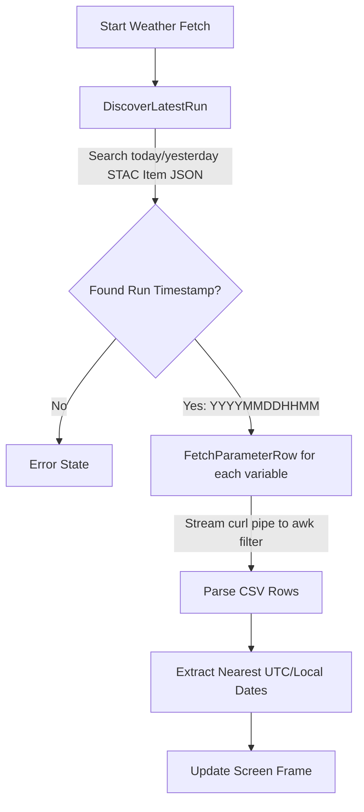

# Developer Guide: Weather & Train Demos

This guide provides a comprehensive technical overview of the custom display animations and data pipelines implemented in this repository. It is designed to help future developers (and AI agents) safely navigate, debug, and expand the code without breaking existing layouts or network API integrations.

---

## 1. Project & Hardware Context

The project is built on the **rpi-rgb-led-matrix** library to drive daisy-chained LED panels on a Raspberry Pi. 
- **Physical Layout**: The system is designed for a **128x64 pixels display**, which consists of two **64x64 pixel panels** chained horizontally.
- **Default Hardware CLI Options**: Configured in [demo-main.cc](file:///Users/joelkammermann/Documents/MENX/RGB-Matrix-Px-xx/example/Rasberry-Pi/examples-api-use/demo-main.cc):
  - `--led-rows=64`
  - `--led-cols=64`
  - `--led-chain=2` (total resolution: 128x64)
  - `--led-parallel=1`
  - `--led-no-hardware-pulse`
  - `--led-slowdown-gpio=4` (slowdown option for Pi 4/5 hardware stability)

---

## 2. Architecture & Main Entrypoint

All custom visualizations inherit from the abstract base class `DemoRunner` defined in [demo-runner.h](file:///Users/joelkammermann/Documents/MENX/RGB-Matrix-Px-xx/example/Rasberry-Pi/examples-api-use/demo-runner.h). It defines:
- A constructor taking a pointer to `rgb_matrix::Canvas`.
- A pure virtual method `virtual void Run() = 0;` which holds the main animation and event loop.

### Entrypoint mapping in [demo-main.cc](file:///Users/joelkammermann/Documents/MENX/RGB-Matrix-Px-xx/example/Rasberry-Pi/examples-api-use/demo-main.cc):
- **Demo ID 13 (`-D 13`)**: MeteoSwiss Weather Demo (`CreateMeteoSwissWeather`).
- **Demo ID 14 (`-D 14`)**: Train Summary Board Demo (`CreateTrainDemo`).

Both demos receive a pointer to the matrix object and optional command-line strings (e.g. station codes/abbreviations) passed at runtime.

---

## 3. MeteoSwiss Weather Demo (`weather-demo.cc`)

The weather demo ([weather-demo.cc](file:///Users/joelkammermann/Documents/MENX/RGB-Matrix-Px-xx/example/Rasberry-Pi/examples-api-use/weather-demo.cc)) fetches regional forecasting details from MeteoSwiss (Federal Office of Meteorology and Climatology) and renders them as custom animated pixel-art icons and temperature readings.

### 3.1 MeteoSwiss API & Network Optimization Pipeline
The demo uses the Swiss government STAC (SpatioTemporal Asset Catalog) API to download raw CSV data.



1. **Latest Run Discovery (`DiscoverLatestRun`)**:
   - Queries `https://data.geo.admin.ch/api/stac/v1/collections/ch.meteoschweiz.ogd-local-forecasting/items/{YYYYMMDD}-ch` (retrying today, yesterday, and 2 days ago).
   - Searches the JSON response to find the newest run date and 12-digit timestamp (`vnut12.lssw.YYYYMMDDHHMM`).
2. **Network-Optimized CSV Downloads (`FetchParameterRow`)**:
   - Downloading raw country-wide CSV forecasts is slow and memory-intensive.
   - **Optimization**: The query pipes `curl` directly into `awk`. 
   - `awk` filters lines matching the target location ID and immediately stops (`exit`) as soon as the date threshold is exceeded (or when the location matching block finishes). This reduces data transfer from megabytes to kilobytes.
3. **Parameters Fetched**:
   - `tre200h0`: Hourly Temperature (2m height)
   - `jww003i0`: Hourly Weather Pictograms (current weather conditions)
   - `tre200dn`: Daily Minimum Temperature (for tomorrow)
   - `tre200dx`: Daily Maximum Temperature (for tomorrow)
   - `jp2000d0`: Daily Weather Pictograms (for tomorrow)

### 3.2 Location Mapping (`MapAbbrToPoint`)
Converts input command-line strings into MeteoSwiss internal point identifiers:
- `LUZ` / Default $\rightarrow$ Point `68`, Display Name: "Luzern" (SwissMetNet station)
- `BAS` $\rightarrow$ Point `75`, Display Name: "Basel"
- `BER` $\rightarrow$ Point `78`, Display Name: "Bern"
- `ZRH` / `SMA` $\rightarrow$ Point `71`, Display Name: "Zurich"
- `GVE` $\rightarrow$ Point `58`, Display Name: "Geneva"
- `LUG` $\rightarrow$ Point `47`, Display Name: "Lugano"
- If a 4-digit code is provided (e.g., `6000`), it maps to a postcode point (`600000`) with Point Type ID `2`.

### 3.3 Weather Code Normalization (`GetWeatherType`)
MeteoSwiss uses over 40 pictogram codes. `GetWeatherType` normalizes them by stripping night offsets (subtracting 100 for codes > 100) and mapping them to a simplified `WeatherType` enum:
- `WEATHER_SUN`
- `WEATHER_CLOUD`
- `WEATHER_RAIN`
- `WEATHER_SUN_CLOUD`
- `WEATHER_SNOW`
- `WEATHER_THUNDER`
- `WEATHER_FOG`

### 3.4 Animation & Pixel-Art Sprites
The custom sprites are drawn directly into the offscreen framebuffer row-by-row on every cycle using a tick-counter.

- **`WEATHER_SUN`**: Alternate flashing rays frame-by-frame every 500ms (`tick / 5 % 2`).
- **`WEATHER_CLOUD`**: Drifts horizontally left-and-right by a few pixels using a pre-defined displacement array:
  `int drift[] = {0, 0, 1, 1, 2, 2, 1, 1, 0, 0, -1, -1, -2, -2, -1, -1}`.
- **`WEATHER_RAIN`**: Combines the drifting cloud with a 3-frame vertical scroll animation of blue falling raindrop lines (`(tick / 2) % 3`).
- **`WEATHER_SUN_CLOUD`**: Renders a stationary yellow sun behind a drifting foreground grey cloud.
- **`WEATHER_SNOW`**: Combines the drifting cloud with a 4-frame vertical scroll of white snow pixels (`(tick / 4) % 4`).
- **`WEATHER_THUNDER`**: Renders a dark storm cloud and triggers a double-flash bright yellow lightning bolt frame at interval boundaries (`(tick % 12 == 0) || (tick % 12 == 2)`).
- **`WEATHER_FOG`**: Draws 4 horizontal grey mist bands shifting horizontally at different relative speeds using drift variables.

### 3.5 Screen Layout Coordinate Map (128x64 Setup)
The interface is split logically across the panels to show the clock centered globally and weather details side-by-side on the left:

```
+-------------------------------------------------------------------+
|                            [10x20 Uhr]                            | (Centered Clock at x = 64)
|                                                                   |
|     (x = 8 to 24)              (x = 40 to 56)                     |
|     [Icon HEUTE]                [Icon MORGEN]                     | (y = 18)
|        HEUTE                       MORGEN                         | (y = 30, Blue Text)
|        21°C                         18°C                          | (y = 38, White Text)
+-------------------------------------------------------------------+
|                           Panel 1 (0-63)                          |
+-------------------------------------------------------------------+
```

- **Uhr / Clock**: Centered globally. Measured text length subtracted from 128 and divided by 2 (`x_clock = (128 - clock_text_width) / 2`).
- **HEUTE (Now) Column**: Centered horizontally at **x = 16**.
- **MORGEN (Tomorrow) Column**: Centered horizontally at **x = 48**.

### 3.6 Development Mode (`DEV` station parameter)
To preview, debug, or validate pictogram animations:
1. Run: `sudo ./demo -D 13 DEV`
2. **Terminal Raw Mode**: `TerminalRawMode` registers keyboard events directly without needing `<ENTER>`.
3. **Interactive Cycle Controls**:
   - `[SPACE]`, `[ENTER]`, or `[N]/[n]`: Cycle to the **next** weather icon.
   - `[P]/[p]`: Cycle to the **previous** weather icon.
   - `[CTRL-C]`: Terminate program cleanly and restore standard terminal mode.
4. **Display**: Displays the current icon under the "HEUTE" column (with name label) and the next consecutive icon under the "MORGEN" column (with name label).

---

## 4. Train Demo (`train-demo.cc`)

The train summary demo ([train-demo.cc](file:///Users/joelkammermann/Documents/MENX/RGB-Matrix-Px-xx/example/Rasberry-Pi/examples-api-use/train-demo.cc)) fetches real-time departure boards for Swiss transit stations and showcases an animated steam train running along the bottom.

### 4.1 Transport API & Manual Parsing
- **API Endpoint**: Queries the Swiss public transport API:
  `https://transport.opendata.ch/v1/stationboard?station={StationName}&limit=4`
- **JSON Parsing**: As the demo is written in low-level C++ without external library dependencies, it parses raw JSON strings manually. It does this by scanning substrings using `std::string::find` for specific tokens:
  - `"to":"` (destination direction)
  - `"departure":"` (departure datetime)
  - `"platform":"` (track/platform)
  - `"delay":` (minute delay, e.g. delay on departure)

### 4.2 Screen Layout Coordinate Map (128x64 Setup)
The layout separates the global clock from the destination list:

```
+-------------------------------------------------------------------+
|                            [10x20 Uhr]                            | (Centered Clock at x = 64)
|                                                                   |
|                                                                   |
|   (x = 66)                       (x = 100)           (x = 123)    |
|   [Destination]                  [HH:MM/Delay]       [Platform]   | (y = 15+, 4 lines)
|                                                                   |
|      ====OO=OO=O_  (Animated Steam Train moving left/right)       | (y = 52)
+-------------------------------------------------------------------+
| Panel 1 (0-63) for Train Animation | Panel 2 (64-127) for Info    |
+-------------------------------------------------------------------+
```

- **Uhr / Clock**: Centered globally.
- **Board Area**: Rendered on the **right panel** (`x >= 64`).
  - `x_dest`: `x_base + 2` (where `x_base = matrix_->width() - panel_width` = 64)
  - `x_time` (or Delay): `x_base + 36`
  - `x_platform`: `x_base + 59` (i.e. `x_time + 23`)
- **Toggling display fields**: Every 2.5 seconds, the board swaps between displaying departure times (e.g. `14:32`) and delay minutes (e.g. `+5` in red color).

### 4.3 Steam Train Animation
A pixel-art steam train is animated moving along the bottom of the screen (`y = height - 12`).
- **Sprite**: Drawn in [DrawSteamTrain](file:///Users/joelkammermann/Documents/MENX/RGB-Matrix-Px-xx/example/Rasberry-Pi/examples-api-use/train-demo.cc#L258-L304) using character matrices:
  - `X`: Dark body (`30, 35, 45`)
  - `W`: Cabin window highlight (`180, 240, 255`)
  - `R`: Wheel hub indicators (`220, 60, 60`)
  - `S`: Steam/smoke particles (`170, 170, 160`)
- **State Machine**: Cycles through states:
  - `MOVING_RIGHT`: Translates left-to-right across the matrix.
  - `WAIT_RIGHT`: Rests off-screen to the right for 40 frames (~2 seconds).
  - `MOVING_LEFT`: Translates right-to-left.
  - `WAIT_LEFT`: Rests off-screen to the left for 40 frames (~2 seconds).
- **Sprite Mirroring**: The boolean parameter `flipped` triggers horizontal mirroring of column rendering depending on whether the train is moving right or left.

---

## 5. Build, Run, and Deployment

### Compilation
The program is built using GNU Make. Run compilation commands from the examples directory:
```bash
cd example/Rasberry-Pi/examples-api-use
make
```

### Running the Programs
The binary requires superuser privileges (`sudo`) to gain low-level GPIO timing control on the Raspberry Pi:

```bash
# Run Weather Demo for Lucerne (Default)
sudo ./demo -D 13

# Run Weather Demo for Zurich
sudo ./demo -D 13 ZRH

# Run Weather Demo in Pictogram Dev/Validation Mode
sudo ./demo -D 13 DEV

# Run Train Board Demo for station Emmenbrücke (Default)
sudo ./demo -D 14
```

---

## 6. Guidelines for Making Future Modifications

- **Layout Grid Integrity**: Always respect the split-panel logic. If adding features to the weather screen, keep the items within `x = 0` to `x = 63` to ensure they do not clash with the global centered clock or drift onto the second panel.
- **Awk Optimization**: If you modify the parameters queried in `weather-demo.cc`, ensure the `awk` command contains proper early-exit bounds. Removing or corrupting `awk` early-exits will cause the Pi to download multiple megabytes of raw Swiss climate records on each cycle, hanging the refresh loop.
- **Canvas Swapping**: Demos utilize double-buffering. Render everything to `offscreen_` and swap the canvases using `matrix_->SwapOnVSync(offscreen_)` at the end of the loop iteration to prevent screen tearing.
- **Raw Terminal Reset**: The `TerminalRawMode` class uses C RAII destructor principles to automatically reset termios properties back to standard configuration when the weather demo exits. If adding exits or crashes, make sure raw mode is disabled to prevent locking user terminals.
